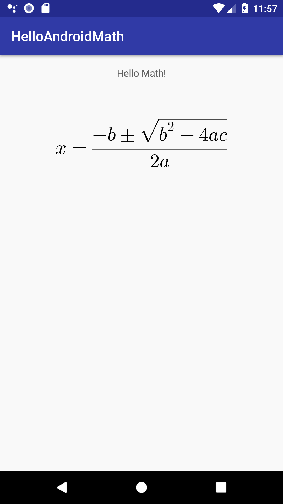

# HelloAndroidMath

Simple example for using [AndroidMath](https://github.com/gregcockroft/AndroidMath)



Installation from the command line
----------------------------------

```
git clone https://github.com/gregcockroft/HelloAndroidMath.git

cd HelloAndroidMath
./gradlew installDebug
```

Installation for Android Studio
----------------------------------

Open and run the project in Android Studio 


Using in your app
-------------------------


Add below lines to root's build.gradle

```groovy
	allprojects {
		repositories {
			...
			maven { url 'https://jitpack.io' }
		}
	}
```

Add below lines to apps's build.gradle

```groovy
dependencies {
	        implementation 'com.github.gregcockroft:AndroidMath:-TESTA'
	}
	
```

```xml
<ConstraintLayout ...>

    <TextView
        android:id="@+id/description"
        android:layout_width="wrap_content"
        android:layout_height="wrap_content"
        android:text="Hello Math!"
        app:layout_constraintBottom_toTopOf="@+id/mathview"
        app:layout_constraintLeft_toLeftOf="parent"
        app:layout_constraintRight_toRightOf="parent"
        app:layout_constraintTop_toTopOf="parent" />
      
    <com.agog.mathdisplay.MTMathView
        android:id="@+id/mathview"
        android:layout_width="wrap_content"
        android:layout_height="wrap_content"
        android:layout_marginTop="56dp"
        app:layout_constraintLeft_toLeftOf="parent"
        app:layout_constraintRight_toRightOf="parent"
        app:layout_constraintTop_toBottomOf="@id/description" />


</ConstraintLayout>
```

```kotlin
    override fun onCreate(savedInstanceState: Bundle?) {
        super.onCreate(savedInstanceState)
        setContentView(activity_main)

        mathview.latex = "x = \\frac{-b \\pm \\sqrt{b^2-4ac}}{2a}"
    }
	
```

  
## License

HelloAndroidMath is available under the MIT license. See the [LICENSE](./LICENSE)
file for more info.

